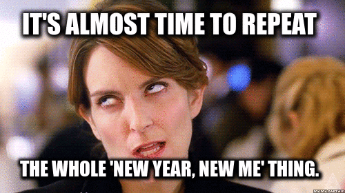
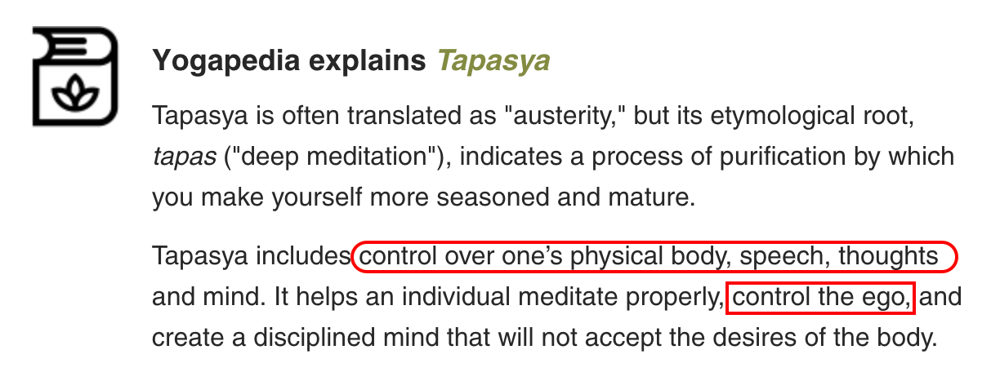

# What did you learn in 2017 - A review
> Annual Review Security Learning 2017

### Null/OWASP/G4H combined monthly meet - Dec 2017
#### Akash Mahajan

### Follow up of my talk from Jan 2017

### What did we cover in that talk?
- Our reasons for learning
- Getting started with listing out what we want to learn
- Creating a timeline using Google Calendar

# On a piece of paper
- Note down the answers to the following questions <!-- .element: class="fragment"  data-fragment-index="1" -->
- Please remember there are no wrong answers <!-- .element: class="fragment" data-fragment-index="2" -->
> Nobody has to to show this to me or anyone else, so be honest! <!-- .element: class="fragment highlight-red" data-fragment-index="3" -->

## So what did you learn this year related to tech and Security?
- I learnt things like Docker and Kubernetes <!-- .element: class="fragment"  data-fragment-index="1" -->
- I learnt a bit of Golang programming<!-- .element: class="fragment"  data-fragment-index="2" -->
- I learnt a proper JavaScript frontend framework/lib VueJS<!-- .element: class="fragment"  data-fragment-index="3" -->

## What are the factors that enabled learning? 
- I started using containers for development and deployments<!-- .element: class="fragment"  data-fragment-index="1" -->
- Me and my wife decided to take an introductory book on Golang and follow it<!-- .element: class="fragment"  data-fragment-index="2" -->
- I like to build simple Python applications which are typically designed in a RESTful manner. Learning a proper JS framework meant no longer having to write the HTML code for it<!-- .element: class="fragment"  data-fragment-index="3" -->

## What are the things you wanted to but didn't learn?
- Static Malware Analysis<!-- .element: class="fragment"  data-fragment-index="1" -->
- Writing assembly <!-- .element: class="fragment"  data-fragment-index="2" -->

## What came in the way of not learning?
- Mostly because I didn't care enough<!-- .element: class="fragment"  data-fragment-index="1" -->
- I didn't have any goal oriented outcomes planned <!-- .element: class="fragment"  data-fragment-index="2" -->

## Goal oriented outcomes such as 
- To build good looking webapps I learn VueJS (FOMO)<!-- .element: class="fragment"  data-fragment-index="1" -->
- To do the development properly I learnt how to use containers for Python flask (Because cool kids)<!-- .element: class="fragment"  data-fragment-index="2" -->
- To spend quality time with my wife 2 hours per week of Golang programming (My sneaky plan was her to learn logic the way I understand it)<!-- .element: class="fragment"  data-fragment-index="3" -->

# Some theories why this really happens
<!-- .slide: data-background-video="images/theories.mp4" data-background-size="cover" --> 

# If we were a planet
<!-- .slide: data-background-video="images/planet.mp4" data-background-size="cover" -->
- We would be littered with projects half done<!-- .element: class="fragment"  data-fragment-index="1" -->
- Usually the half that is done is the easy one<!-- .element: class="fragment"  data-fragment-index="2" -->

## Mainly because we all believe in having infinite amount of time
<!-- .slide: data-background-video="images/infinite-time.mp4" data-background-size="cover" -->
- That we will get to doing the work some day<!-- .element: class="fragment"  data-fragment-index="1" -->

## But when we don't plan our time
<!-- .slide: data-background-video="images/time-pass.mp4" data-background-size="cover" -->
- It passes really quickly<!-- .element: class="fragment"  data-fragment-index="1" -->

## Time and Tide wait for none
<!-- .slide: data-background-video="images/time-and-tide.mp4" data-background-size="cover" -->
- The old adage is still true<!-- .element: class="fragment"  data-fragment-index="1" -->

# What could be done differently? 

## No real alternative to practice
<!-- .slide: data-background-video="images/practice.mp4" data-background-size="cover" -->
- Good old fashioned hard work is required sometimes<!-- .element: class="fragment"  data-fragment-index="1" -->

### According to smart people on Wikipedia

### Applying the right amount of heat makes for one delicious outcome
<!-- .slide: data-background-video="images/heat-cookies.mp4" data-background-size="cover" -->

## Right amount of heat

## You should know that distractions are not helpful
<!-- .slide: data-background-video="images/distractions.mp4" data-background-size="cover" -->
- In this day and age they are many and very frequent<!-- .element: class="fragment"  data-fragment-index="1" -->

## Focus is the key
<!-- .slide: data-background-video="images/focus.mp4" data-background-size="cover" -->
- [Read about Pomodoro technique](https://en.wikipedia.org/wiki/Pomodoro_Technique)<!-- .element: class="fragment"  data-fragment-index="1" -->
- This could for 10 minutes, 25 minutes to 40 minutes at a stretch<!-- .element: class="fragment"  data-fragment-index="2" -->

## Not knowing what to focus on, makes things foggy
<!-- .slide: data-background-video="images/fog-when-what-is-not-clear.mp4" data-background-size="cover" -->
- Especially the part about "how something will get done"<!-- .element: class="fragment"  data-fragment-index="1" -->
- A fundamental mistake made by people is to answer how something will get done, before being clear on what needs to be done<!-- .element: class="fragment"  data-fragment-index="2" -->

## When what needs to be done is clear, the fog melts away
<!-- .slide: data-background-video="images/things-are-clear-when-what-is-clear.mp4" data-background-size="cover" -->
- Clarity encourages hard work<!-- .element: class="fragment"  data-fragment-index="1" -->

## It is tempting to go alone
<!-- .slide: data-background-video="images/lone-wolf.mp4" data-background-size="cover" -->
- But the reality is, there is a reason you haven't started learning all the things you wanted to learn.<!-- .element: class="fragment"  data-fragment-index="1" -->
- Mental discipline is a tough ask<!-- .element: class="fragment"  data-fragment-index="2" -->

## Buddies can make the workload easier to manage
<!-- .slide: data-background-video="images/buddies.mp4" data-background-size="cover" -->
- Doesn't matter if it is for a scary ride in an amusement park or learning something equally scary<!-- .element: class="fragment"  data-fragment-index="1" -->

# Getting any ideas? 
<!-- .slide: data-background-video="images/bulb.mp4" data-background-size="cover" -->

## You need to become comfortable with fear of failure
<!-- .slide: data-background-video="images/failure-building.mp4" data-background-size="cover" data-background-video-muted="true" -->

## Failure is bound to happen
<iframe src="https://giphy.com/embed/HrydPrw0zphAs" width="480" height="278" frameBorder="0" class="giphy-embed" allowFullScreen></iframe>
<a href="https://giphy.com/gifs/birdman-alejandro-gonzlez-irritu-or-the-unexpected-virtue-of-ignorance-HrydPrw0zphAs">via GIPHY</a>

## The question is, what happens next
<iframe src="https://giphy.com/embed/ylclh9UEymjfy" width="480" height="270" frameBorder="0" class="giphy-embed" allowFullScreen></iframe>
<a href="https://giphy.com/gifs/fail-bowling-strike-ylclh9UEymjfy">via GIPHY</a>

## Principles of Learning (My version)

## Your prior knowledge can help or hinder learning
<!-- .slide: data-background-video="images/breaking-your-limitations.mp4" data-background-size="cover" data-background-video-muted="true" -->

## How you organise knowledge influences how you will learn and *apply*
<!-- .slide: data-background-video="images/notes.mp4" data-background-size="cover" data-background-video-muted="true" -->

## Your motivation plays a crucial role
<!-- .slide: data-background-video="images/motivation-when-facing-challenges.mp4" data-background-size="cover" data-background-video-muted="true" -->
- Especially when facing an uphill climb<!-- .element: class="fragment"  data-fragment-index="1" -->

## To develop mastery, you must
<!-- .slide: data-background-video="images/cooking-and-mastery.mp4" data-background-size="cover" data-background-video-muted="true" -->
1. acquire various skills<!-- .element: class="fragment"  data-fragment-index="1" -->
2. practice integrating them and <!-- .element: class="fragment"  data-fragment-index="2" -->
3. most importantly know when to apply what you have learned<!-- .element: class="fragment"  data-fragment-index="3" -->
 

## Always do Goal directed practice
<!-- .slide: data-background-video="images/cycling-memory.mp4" data-background-size="cover" data-background-video-muted="true" -->
- This should become muscle memory<!-- .element: class="fragment"  data-fragment-index="1" -->

## To become self directed learner, you must 
<!-- .slide: data-background-video="images/specific-measurable.mp4" data-background-video-muted="true" -->
- learn to monitor<!-- .element: class="fragment"  data-fragment-index="1" -->
- adjust your approach to learning<!-- .element: class="fragment"  data-fragment-index="2" -->

### I assert that it is fun learning as a community
<!-- .slide: data-background-video="images/fun-learning-as-a-community.mp4" data-background-size="cover" data-background-video-muted="true" -->

### I invite you to start 2018 by learning as a community at null/OWASP/G4H
<!-- .slide: data-background-video="images/have-a-great-new-year.mp4" data-background-size="cover" data-background-video-muted="true" -->